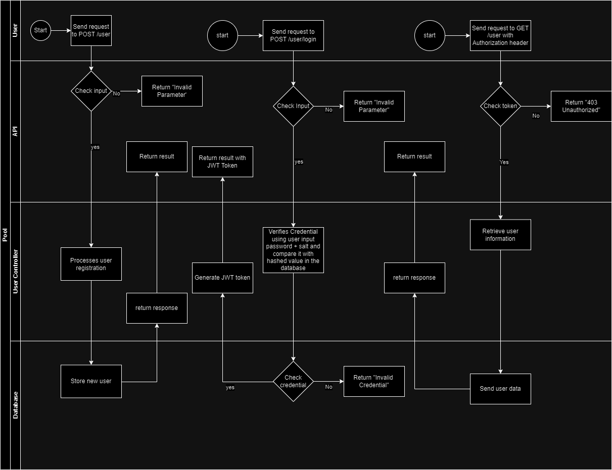

# User Management System

This project is a user management system built with Node.js, Express, and MySQL. It provides functionalities for user registration, login, password management, and user data management.

## Table of Contents

- [Installation](#installation)
- [Usage](#usage)

## Installation

1. Install the dependencies:
   ```sh
   npm install
   ```
2. Set up the environment variables: Create a .env file in the root directory and add the following:

   ```sh
       DB_HOST=your_database_host
      DB_USER=your_database_user
      DB_PASSWORD=your_database_password
      DB_NAME=your_database_name
      JWT_SECRET=your_jwt_secret
   ```

3. Run the application:
   ```sh
   nodemon ./index.js
   ```

## Usage

The application provides a RESTful API for managing users. You can use tools like Postman or cURL to interact with the API.

# API Endpoints

### User Registration

- URL: /user
- Method: POST
- Request Body:
  ```json
  {
    "fullname": "John Doe",
    "email": "johndoe",
    "password": "password",
    "confpassword": "password"
  }
  ```
- Response:
  ```json
  {
    "success": true,
    "result": {
      "uid": "hklu67",
      "fullname": "John Doe",
      "email": "johndoe"
    }
  }
  ```

### User Login

- URL: /user/login
- Method: POST
- Request Body:
  ```json
  {
    "email": "johndoe",
    "password": "password"
  }
  ```
- Response:
  ```json
  {
    "success": true,
    "result": {
      "uid": "hklu67",
      "fullname": "John Doe",
      "email": "johndoe",
      "token": "eyJhbGkaslodjaenhsdhsiadiashjfiashf"
    }
  }
  ```

### Get User Profile

- URL: /user
- Method: GET
- Request Headers:
  ```json
  {
    "Authorization": "Bearer *jwt_token*"
  }
  ```
- Response:
- ```json
  {
    "success": true,
    "result": {
      "uid": "hklu67",
      "fullname": "John Doe",
      "email": "johndoe"
    }
  }
  ```

### Update User Profile

- URL: /user
- Method: PUT
- Request Headers:
  ```json
  {
    "Authorization": "Bearer *jwt_token*"
  }
  ```
- Request Body:
- ```json
  {
    "fullname": "Jane Doe",
    "email": "janedoe"
  }
  ```
- Response:
- ```json
  {
    "success": true,
    "result": {
      "uid": "hklu67",
      "fullname": "Jane Doe",
      "email": "janedoe"
    }
  }
  ```

### Change Password

- URL: /user/changepassword
- Method: PUT
- Request Headers:
  ```json
  {
    "Authorization": "Bearer *jwt_token*"
  }
  ```
- Request Body:
  ```json
  {
    "oldpassword": "password",
    "newpassword": "newpassword",
    "confpassword": "newpassword"
  }
  ```
- Response:
  ```json
  { "success": true }
  ```

### Delete User

- URL: /user
- Method: DELETE
- Request Headers:
  ```json
  { "Authorization": "Bearer *jwt_token*" }
  ```
- Response:
  ```json
  { "success": true }
  ```

### Workflow Diagram


### SQL Injection Prevention
- Fullname can't contain special characters

- Password must be at least 8 characters long and contain one uppercase letter, and one special character

- Email must be in the correct format

